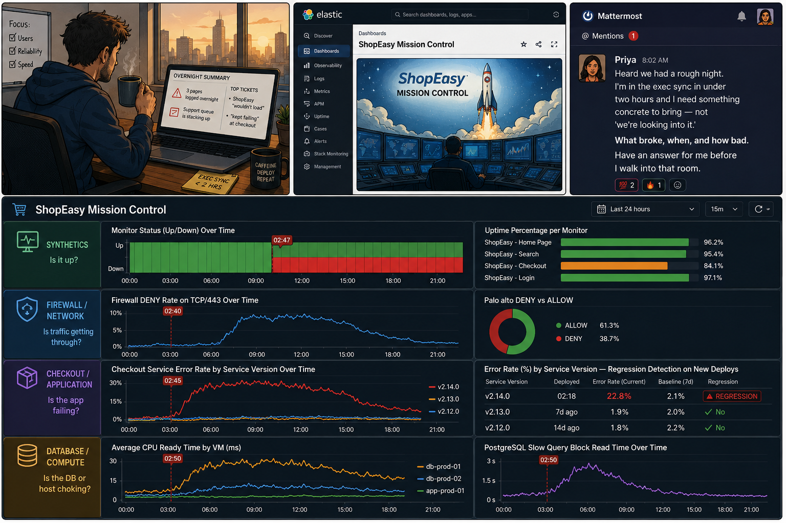
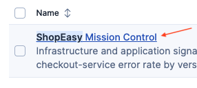
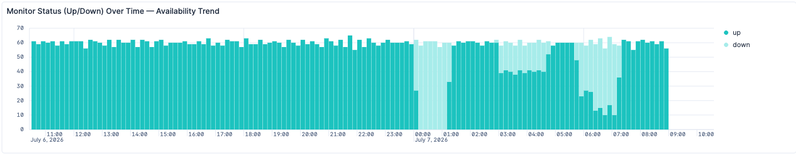
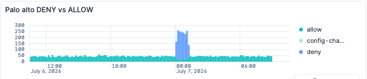
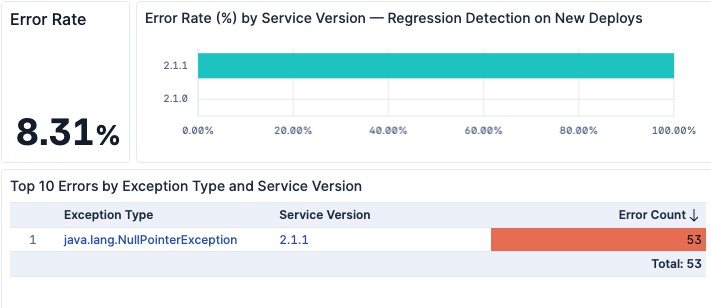
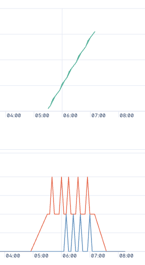
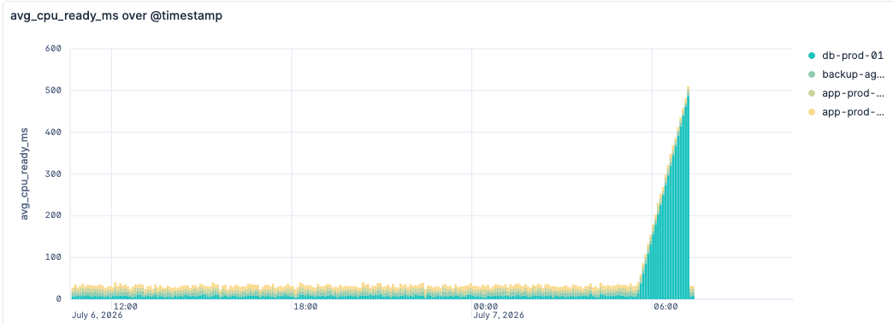

## 06:42 — You Sit Down With Your Coffee
===
You drop into your chair, coffee still too hot to drink, and wake your laptop up. Before you've even taken a sip, the screen tells you it wasn't a quiet night...

Then this lands in Mattermost from your VP:

> **Priya:** "Heard we had a rough night. I'm in the exec sync in under two hours and I need something concrete to bring,  not a *we're looking into it*... I want to know what broke, when, and how bad. Have an answer for me before I walk into that room please"

Let's use the ShopEasy Dashboard to find out the root cause of the overnight Issue

> [!NOTE]
> Walk through the dashboard to catch  anomaly that could have affected the Shopeasy service. When you are ready, click next to answer a Quizz.

> [!IMPORTANT]
> If you don't know where to start, unfold the [Guided Investigations](section-guided-investigations)

Guided Investigations
===
On the [ **elastic**](tab-0) tab, pull up the **ShopEasy Mission Control** dashboard — it's your single pane of glass across the whole stack:

1. **Start with the synthetics up top.** *Monitor Status (Up/Down) Over Time* and *Uptime Percentage per Monitor* will tell you *when* things actually broke, not just that they did.

2. open the **Firewall / Network**  collapsible section

The *Palo alto DENY vs ALLOW*  visualization flags a lot more deny than usual during a 2hours period last night

3. open the **Software status**  collapsible section

We see error rate rising connected to a code version change

4. open the **Postgresql**  collapsible section
 
We see slow queries and locks at the end of the night

5. open the **VMware**  collapsible section

We see cpu ready time raising at the end of the night

