The reporting urgency
===


Now you know the root cause of the overnight disruption. But you already know a short answer and description of what happened will not be enough for Priya... Let's use agentic power of elastic to deliver this report lightning fast!

Use your dedicated agent to create the report
===
1. Click on **AI Agent** on the top right of Kibana tab
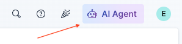
2. Click on the burger Menu and click the arrow to unfold available agents
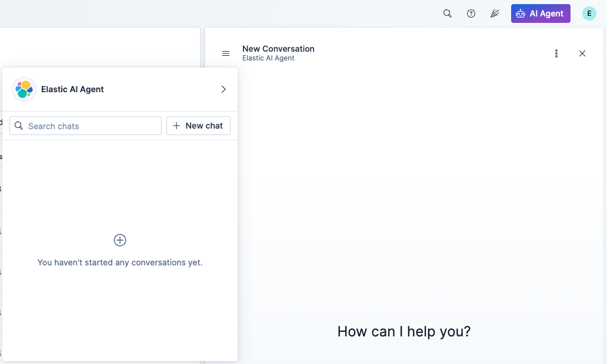
3. Select rca_agent to start a conversation
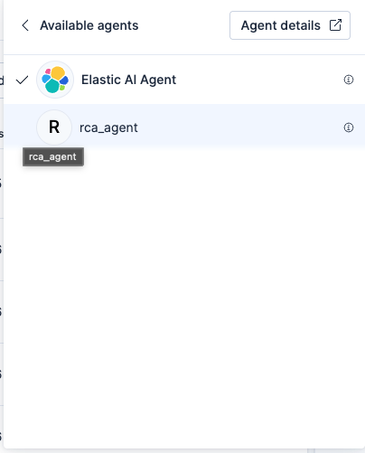
4. Copy and paste the following inside the conversation and press enter
```
Morning meteo report
```
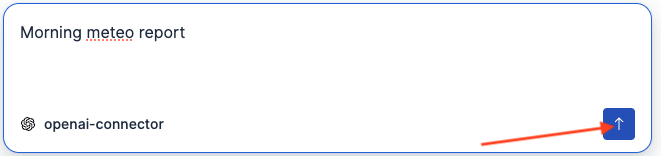
5. After nearly 30 seconds you should see the report of the agent. It should give you insights from the logs you may not even have noticed during the previous challenge
 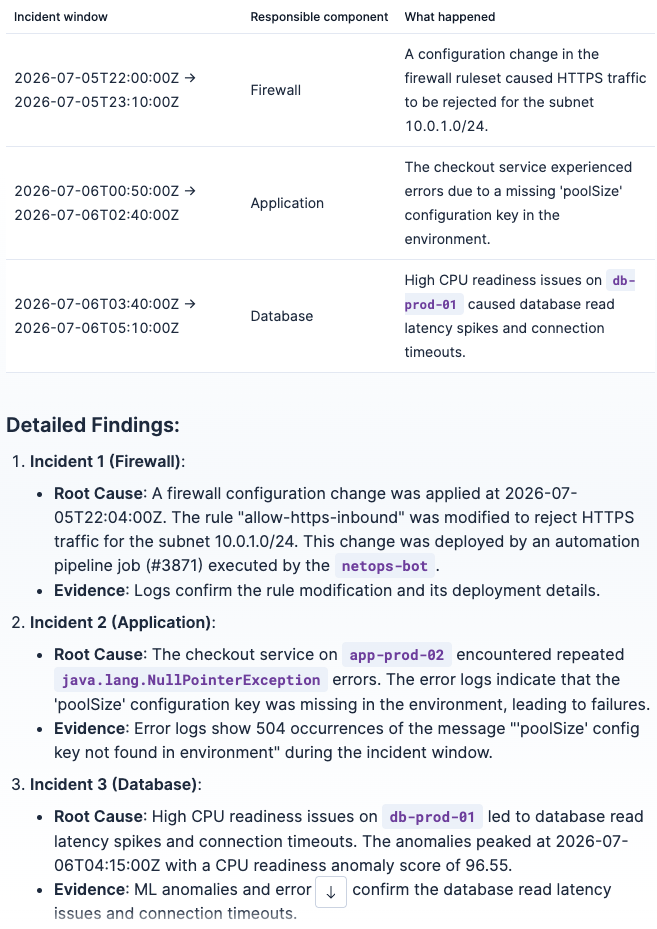
 > [!NOTE]
> This is AI generated data, so content may differ.

Pausing a bit and understand how it works
===
Have a look at the reasoning tab of the conversation
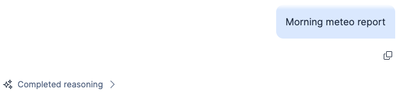
See how the agent goes through synthetics monitoring to state downtime of the App thanks to dedicated tools, and how it correlates these downtimes to machine learning anomaly to get the big picture of potential responsible components
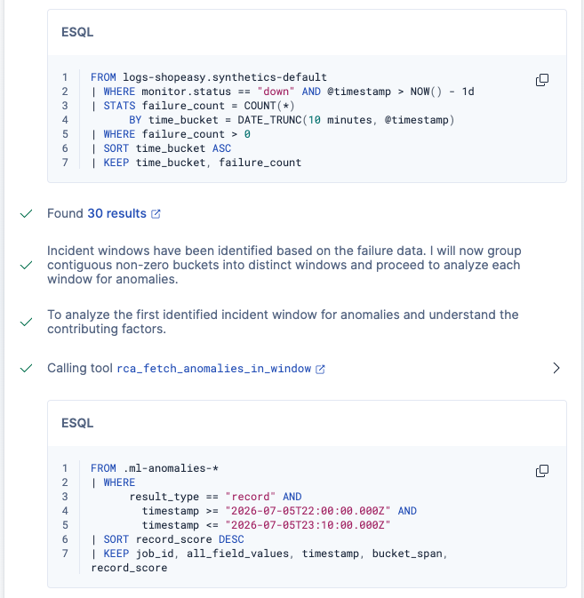
It then confirms these feelings with lightweight logs statistics during the downtime to deepen its knowledge of the situation
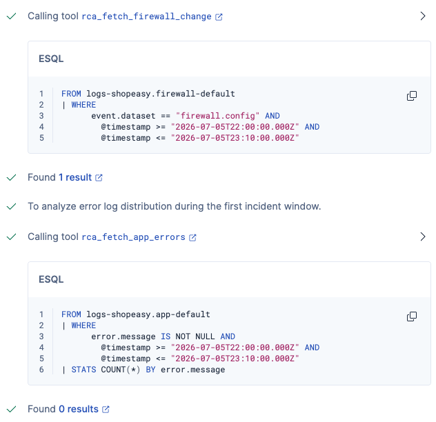

This logic is the exact same an operator specialist would apply, following your internal knowledge base. This procedure has been captured thanks to agent builder in a specific skill to orchestrate tool usage and data understanding.
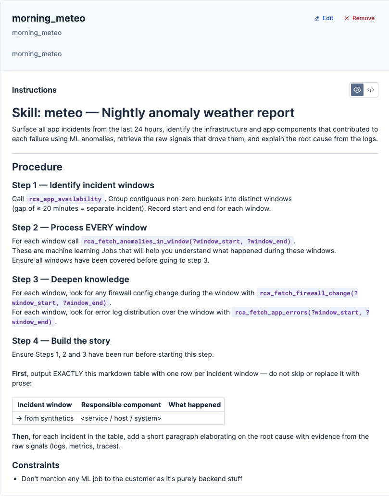
To check this out go to Agent details by clicking the three dots on top of the conversation
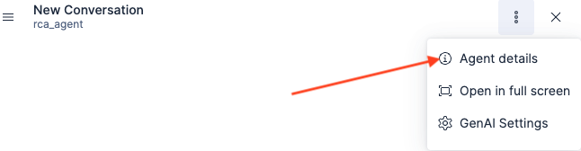
click skills menu and select meteo_morning to see the details of the procedure
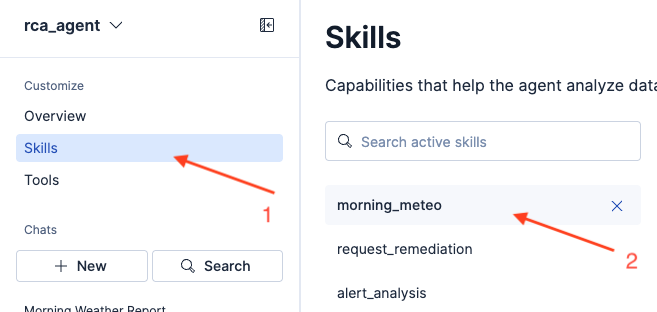
> [!NOTE]
> During this challenge we learned how to use an agent interactively inside the platform to accelerate the diagnostics and root causes analysis of issues. We've seen how fast a well tooled LLM is able to get and correlate signals to analyse complex situation and provide holistic reporting about it
>
> But it's not the end of the story, do you remember this synthetics view?
>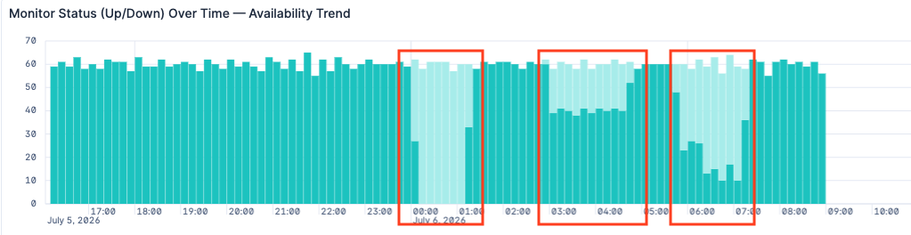
>These closed incident windows mean the problem has been solved during the night!
>
>The on-call people must have been notified to fix the situation!
>
>  Let's discover how in the next challenge!

