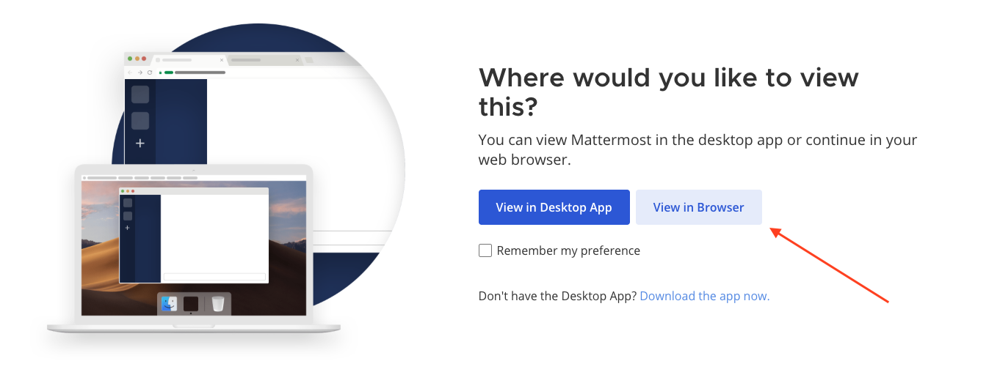
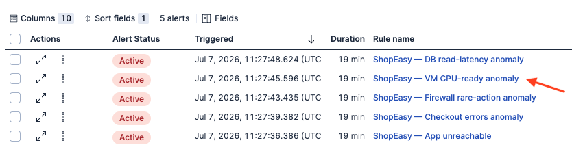
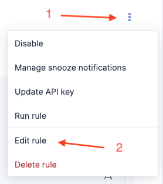
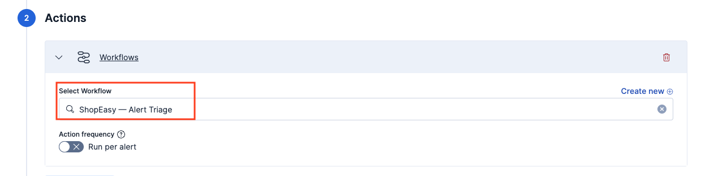
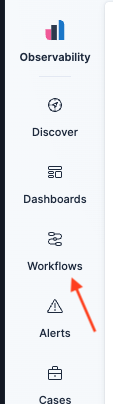
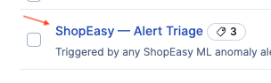
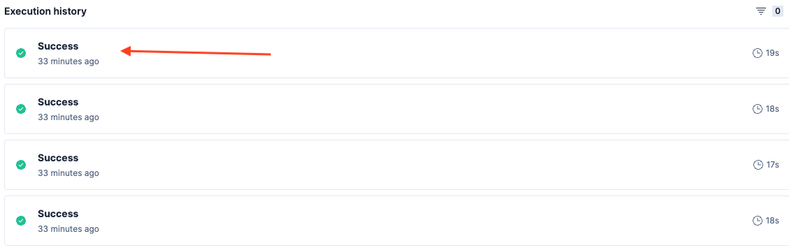
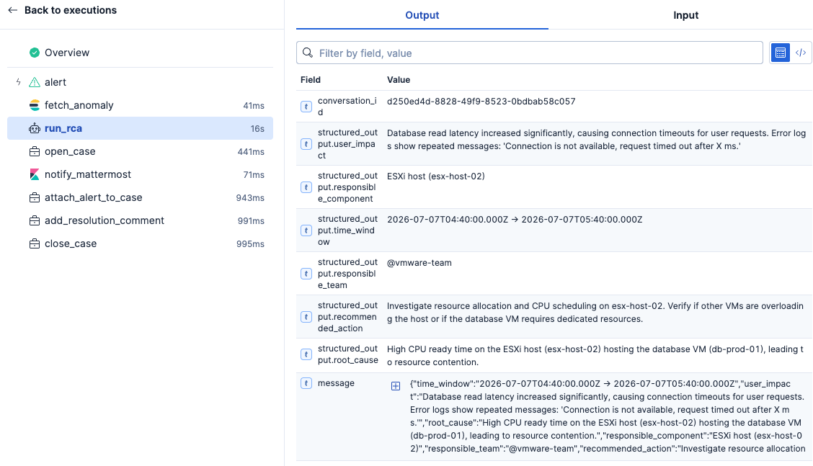

 The Alert That Never Woke You Up
===
Inside  [Mattermost](tab-0) tab , select ```view in browser``` option

log into the server with the following credentials
- User: ```vmware-team```
- Password:  ```Instruqt123!```

Click on the incidents channel

You will see  several message about last night issues

Each alerts have been analyzed so you have in these messages:
- The time slot of the issue
- the description of the root cause found during the investigation
- The team responsible to solve the issue, called out via its Mattermost handle for notification
- A link to the case that have been created into the case management system to log the alert

If you follow this link you will see that the reponsible team have solved the issue and closed this case


> [!NOTE]
> Elastic is watching continuously your MELT data,  has analyzed every alert thrown and routed it to the corresponding on-call team on the dedicated Mattermost incident channel.
>
>  It basically did the L0/L1 support duty in complete autonomy during the night, waking up on-call experts with an analysis of the problem to solve.

 Pause a bit and understand what happened
===
See all the **Alerts** thrown in [elastic](tab-1) tab.  These are the raw machine learning anomaly alerts that fired overnight. It's the ones that kicked off everything you just read in Mattermost.

1.  Click on the **ShopEasy — VM CPU-ready anomaly** alert

2  Click on the three dots top menu, then on **Edit Rule**

3. Scroll down to the **Actions** step of the configuration

This is the wiring! Each rule doesn't just alert, it triggers the **ShopEasy — Alert Triage** workflow the instant it fires.

> [!IMPORTANT]
> Let's check what this workflow does
1. Go to workflows form the left  menu bar

1. Select **ShopEasy — Alert Triage**
 
2. Select **Executions** on the top of the page

3. Select one of the executions inside **Executions history**

4. Take some time to walkthrough all the Executions step, click on Input and Output tabs to understand data flow. See the ```run_rca``` agentic  step performing the analysis of the issue and then push its findings to create a case and notify relevant people on mattermost


> [!IMPORTANT]
>
> During this workshop you learned how **Elastic and Agentic AI**  transform your production's operations.
>
> - *Operators get their lives back.* : No more waking up for false-positive alerts. No more grepping through four different log sources. No more staring at a blank incident report before the first coffee. AI handles the repetitive L0/L1 operational work, escalating only when human expertise and judgment truly matter.
> - *SLO protection* :  Detection, triage, correlation, and routing happen in minutes, not after someone notices the issue and finally identifies the problem. Mean Time to Resolution drops from hours to minutes, preserving your error budget instead of consuming it.
> - *Every investigation follows the same high standard* :  Whether an incident occurs at 2 PM with the entire team online or at 3 AM when nobody is awake, every response follows the same disciplined workflow
>
> This is the shift to AI-augmented operations: not replacing operators, but eliminating operational toil. Humans focus on decisions. AI handles the routine. Your teams get their nights back, while your applications stay protected 24/7.
