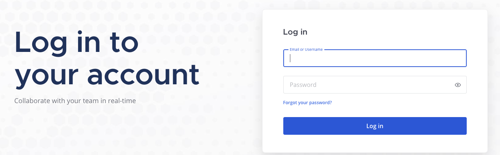
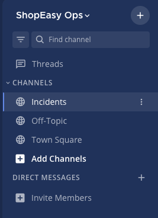
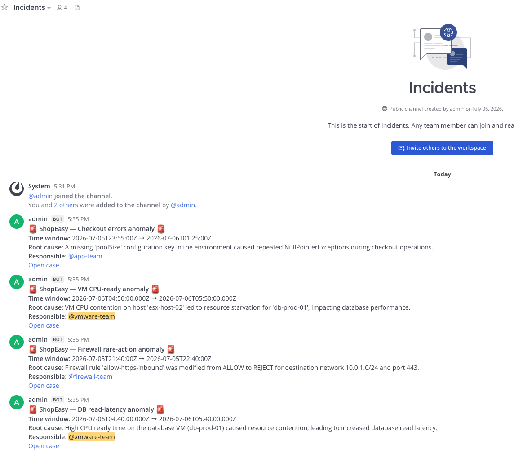
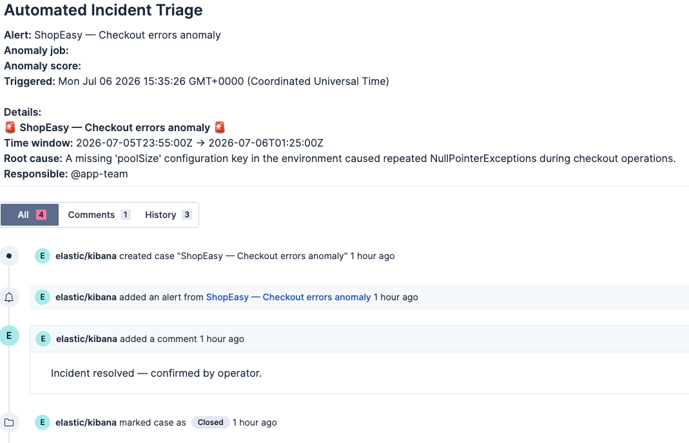

 The Alert That Never Woke You Up
===
Inside  [Mattermost](tab-0) tab  log into the server with the following credentials
- User: ```vmware-team```
- Password:  ```Instruqt123!```

Click on the incidents channel

You will see  several message about last night issues

Each alerts have been analyzed so you have in these messages:
- The time slot of the issue
- the description of the root cause found during the investigation
- The team responsible to solve the issue, called out via its Mattermost handle for notification
- A link to the case that have been created into the case management system to log the alert

If you follow this link you will see that the reponsible team have solved the issue and closed this case


> [!NOTE]
> Elastic his watching continuously you observablity data and has analyzed every alert thrown and routed it to the corresponding on-call team on the dedicated Mattermost incident channel.
>
>  It basically did the L0/L1 support duty in complete autonomy during the night, waking up on-call experts with an analysis of the problem to solve.

## What Actually Happened While You Slept
 Pause a bit and understand what happened
===
Inside [elastic](tab-A) go to **Alerts**. These are the raw machine learning anomaly alerts that fired overnight — the ones that kicked off everything you just read in Mattermost.

1. You'll see the alerts, all already **Active**, one per incident — each one corresponds to an ML job that crossed its anomaly-score threshold during the night

2. Click on one of them, for instance the VM CPU-ready anomaly, to see the underlying ML job and the anomaly score that tripped it

3. Open the rule's **Actions** — this is the wiring. Each rule doesn't just alert, it triggers the **ShopEasy — Alert Triage** workflow the instant it fires

4. Head to **Workflows** and open the run tied to this alert. You'll recognize every step of the case/Mattermost thread you just walked through — fully automated: fetch the anomaly, run the RCA, open the case, notify the on-call team on Mattermost, attach the alert, then close the case


> [!NOTE]
> **During this workshop you learned what Elastic and Agentic AI bring to your observability practice**
>
> - **Operator quality of life**  no false positive pager call, no manual grep through four different log sources, no blank page to fill in before the coffee's even done. The agent absorbs the L0/L1 grind; a human only gets pulled in when real judgment is needed.
> - **SLO protection**  detection, triage and routing happen in minutes instead of however long it takes a person to notice, investigate and correlate synthetics, logs and infra metrics by hand. That's MTTR measured in minutes, not hours, and error budget stays where it belongs.
> - **Consistent investigation quality**  every incident gets the same rigor (downtime window → ML anomaly → logs → root cause), whether it fires at 2pm with the whole team watching or 3am with nobody awake.
>
> That's the AI augmented shift: not replacing the operator, but giving them their nights back while apps protected around the clock.
